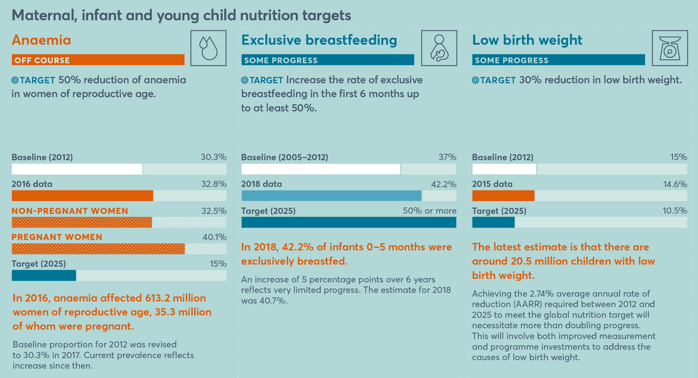
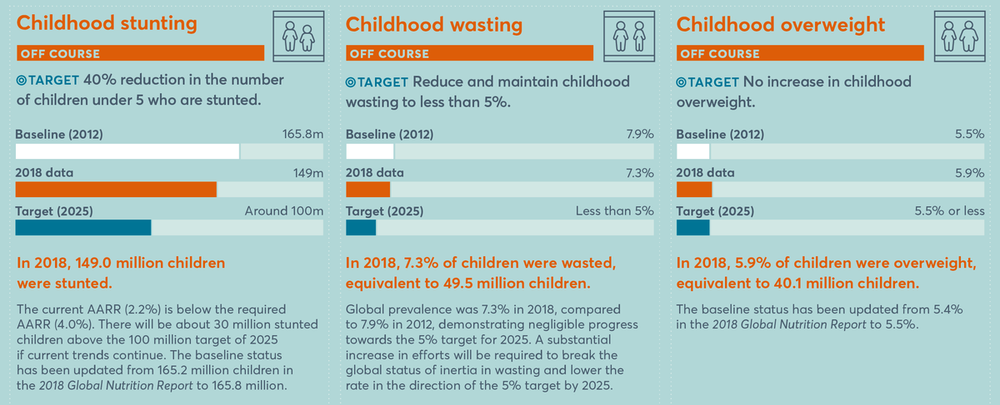
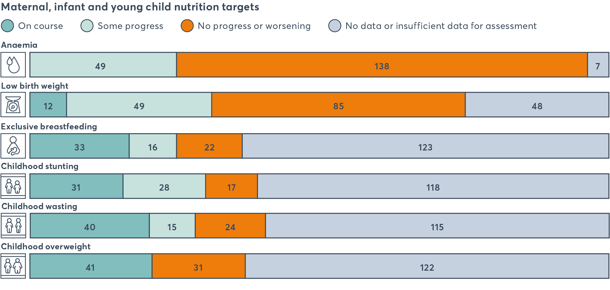

```{r setup, include=FALSE}
options(htmltools.dir.version = FALSE)

if(!require(remotes)) install.packages("remotes")
if(!require(fontawesome)) remotes::install_github("rstudio/fontawesome")
```

```{r xaringan-themer, include=FALSE, warning=FALSE}
library(xaringanthemer)
mono_light(
  base_color = "#002147",
  title_slide_background_image = "https://i.guim.co.uk/img/static/sys-images/Guardian/Pix/pictures/2014/7/29/1406640126780/f089869e-2c47-481b-be03-db976b2ec9e1-1024x768.jpeg?width=620&quality=85&auto=format&fit=max&s=fd5278ce1249bf8f11f78a7bc869933e",
  title_slide_background_size = "cover",
  link_color = "#214700",
  header_font_google = google_font("Fira Sans"),
  text_font_google   = google_font("Fira Sans Condensed"),
  code_font_google   = google_font("Fira Mono"),
  text_slide_number_font_size = "0.5em"
)
```

class: inverse, center, middle

## Ernest Guevarra

### 22 February 2021

#### `r fontawesome::fa("envelope", fill = "white")` [ernest@guevarra.io](mailto:ernest@guevarra.io)  -  `r fontawesome::fa("globe", fill = "white")` [ernest.guevarra.io](https://ernest.guevarra.io)  -  `r fontawesome::fa("linkedin", fill = "white")` [ernestguevarra](https://www.linkedin.com/in/ernestguevarra)    

---

# Outline

* The current global malnutrition burden

* Undernutrition, mortality, and famine oh my!

* Interventions: what works?

---

class: inverse, center, middle

# Global burden of malnutrition

Charts taken from the [2021 Global Nutrition Report](https://globalnutritionreport.org/reports/2020-global-nutrition-report/)

---

# The double burden of malnutrition


---

# The double burden of malnutrition by fragility


---

# Inequalities in childhood malnutrition


---

# Inequalities in child stunting


---

# Inequalities in underweight, overweight and obesity


---

class: inverse, center, middle

# Undernutrition, mortality, and famine oh my!

---

# Which undernutrition?

* Undernutrition - many forms, many manifestations

* When discussing, learning, and researching on the links of nutrition and development, important to distinguish the form/s of malnutrition used

---

# Forms of undernutrition commonly linked to development

* childhood stunting - assessed using height-for-age z-score (HAZ) index

* childhood, adolescent and adult micronutrients deficiency - this includes various forms of anaemia, vitamin A deficiency, folate deficiency, iodine deficiency

---

# Childhood stunting

* important to distinguish the terminology of **stunting** - *the process of growth faltering* - with the terminology of **stunted** - the *state of growth failure*

* a measure of chronic undernutrition measured by height-for-age z-score (HAZ) index

* often used as a target outcome measure or outcome of interest when discussing development processes

---


---

# Micronutrient deficiency

* deficiency in nutrients results from a medium-term process of diet inadequacy - both in quantity and quality

* the level of micronutrient deficiencies at a population level gives an indication of diet quality

* micronutrient deficiency often manifest sub-clinically; when physical signs manifest, condition is often already very severe

---

class: center, middle

.pull-left[
  
]

.pull-right[
  
]

---

class: center, middle

.pull-left[

]

.pull-right[

]

---

class: center, middle

.pull-left[

]

.pull-right[

]

---

# Mortality

* 52.5% of all deaths in young children are attributable to undernutrition; 44.8% in deaths due to measles; 60.7% of deaths due to diarrhoea

* This is interesting from a development perspective given that the types of undernutrition that relates most to mortality (wasting and underweight) are not the measures commonly used in relation to development

* Current research, however, indicate that children who are both underweight and stunted are at greatest risk of death compared to other children

---

# Famines

* The most extreme manifestation of the breakdown of a society's food system that results in excess mortality and increase in incidence of acute wasting

* Acute episode of extreme hunger that results in excess mortality due to starvation or hunger-induced diseases

---

# Defining famine

### *“There is still a major controversy over whether the Ethiopia crisis of 1999-2000 should be labeled a 'famine' or not, in light of the emotive and political connotations of the word.  In the author’s view - given the number of people affected, the damage to livelihoods and human development, and the loss of human life - there is no question about whether Ethiopia 1999-2000 was a famine.  But the continued controversy over this issue points to the need for a broadly accepted operational definition of famine.”* (Maxwell, 2005)

---

class: inverse, center, middle

## *“Famine is a socio-economic process which causes the accelerated destitution of the most vulnerable, marginal and least-powerful groups in a community, to a point where they can no longer, as a group, maintain a sustainable livelihood.  Ultimately, the process leads to the inability of the individual to acquire sufficient food to sustain life.”* (Walker, 1989)

---

# Useful definitions?

## *“Most definitions merely provide ‘a pithy description’ of what happens during famines, rather than ‘helping us to do the diagnosis - the traditional function of a definition’.”* (Sen 1981)

---

# Declaring a famine

* Highly politicised label

* When is a ‘famine’ declared and who decides?

* Incentives or disincentives to declare

* What are the information needs and how reliable are information sources?

---

# Food availability decline (FAD)

* Supply theory of famine

* Shortage of food 

* Assessed through estimation of 

    * Food production (+) 
    * Imports (+)
    * Exports (-)
    * Wastage (-)
    * grain needed for sowing (-)
    * residual stocks (+)

---

# Causes of FAD

* Drought or floods

* Diseases of plants or animals

* Declines in soil productivity

* Conflict

* Government policies (e.g. cash cropping)

* Regulations on land use

* Trade regulations

* Alternative use of agricultural production (e.g. Food as fuel)

---

# Food entitlement decline (FED)

* Demand theory of famine

* Failure to demand even when supply sufficient

* Types of entitlements (entitlement set):

    * Ownership
    * Exchange
    * Non-market 

* Relationship between non-food and food prices

* Famine may result form a change in the price of key items in the entitlement set

---

# Market failures

* Imperfect system of distribution

    * Infrastructure
    * Transport (ownership, repair, alternative uses)

* Physical fragmentation

    * Transaction costs & risks (physical isolation, imperfect information)

* Speculation and hoarding

    * Collusion of merchants to artificially limit supply in order to increase costs and profits
    
---

# Modern famines

* Complex combinations of many factors including FAD and FED and market failures

* Conflicts and/or sanctions

* Pandemic (?)

---

class: inverse, center, middle

# Interventions: what works and what have we achieved?

---

class: center, middle



---

class: center, middle



---

class: center, middle


---

# Development interventions in relation to nutrition outcomes

* Impact of development interventions is a mixed bag

* Complexity and fluidity of the on-the-ground situation often not matched by the modality and implementation of the interventions

* Scaling up of interventions to reach greatest coverage continue to be a problem even in non-crisis/famine situations and fails terribly in crisis situations

* Continuing tension between development and humanitarian interventions; between sustainable response or emergency response

---

# Food systems approach

* encompass the entire range of actors and their interlinked value-adding activities involved in the
production, aggregation, processing, distribution, consumption and disposal of food products that originate from agriculture,
forestry or fisheries, and parts of the broader economic, societal and natural environments in which they are embedded.

* The food system is composed of sub-systems (e.g. farming system, waste management system, input supply system, etc.)
and interacts with other key systems (e.g. energy system, trade system, health system, etc.).

* A sustainable food system (SFS) is a food system that delivers food security and nutrition for all in such a way that the
economic, social and environmental bases to generate food security and nutrition for future generations are not compromised. 

---

class: inverse, center, middle

# Questions?


